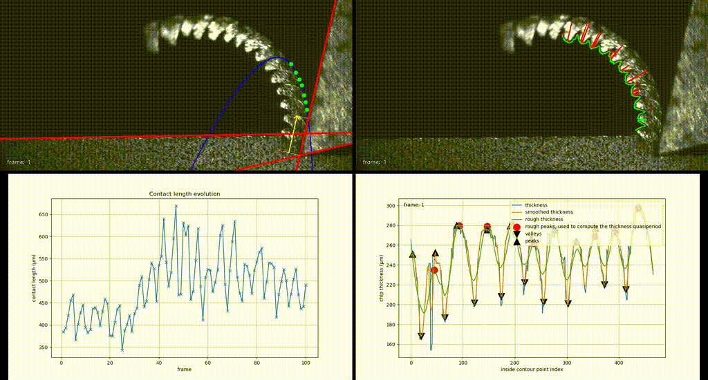

ChipAnalyser - Image-Processing for Machining Chip Analysis
===========================================================

# Overview
ChipAnalyser is an image-processing program designed to analyze machining chips from a series of images or a video file. It measures the following characteristics of the chip in each image:
- Tool-chip contact length
- Average peak thickness
- Average valley thickness
Measurement results are saved in a CSV file. Additionally, the program can generate graphical renderings to illustrate the measurement process.




# Usage
```shell
python3 ChipAnalyser [-S] -i INPUT_IMAGES -o OUTPUT_DIRECTORY [-s SCALE] [-b BATCH_SIZE] [-r]
```
`-S, --silent`: if this option is enabled, the program does not display progress bar

`-i INPUT_IMAGES`: path to the directory containing the images to be analyzed, or path to the video whose images are to be analyzed.

`-o OUTPUT_DIRECTORY`: path to the directory where output files will be written

`-s SCALE`: length of a pixel in µm (1 by default).

`-b BATCH_SIZE`: size of the input image batches (10 by default).

`-r`: if this option is enabled, the program produces graphical renderings of the feature extractions, else, no rendering is done and the program simply extracts the features from the inputs.


# Dependencies
- NumPy: Perform vectorized operation on large arrays.
- OpenCV: Implementation of famous image processing algorithms.
- SciPy: Signal processing to find peaks and valleys after chip thickness measurement.
- Scikit-image: Read input image files. Provides a line rasterization algorithm used to detect the inner contour of the chip by ray casting.
- Scikit-video: Read input video file. Write output video files.
- Matplotlib: Generate output plots.

## Install dependencies in a virtual environment with conda (recommended)
```shell
# create and activate the virtual environment
conda create -n machining-chip-analysis python=3.11
conda activate machining-chip-analysis

# install dependencies inside the virtual environment
conda install "numpy<1.24" opencv -c conda-forge
conda install matplotlib scikit-video -c conda-forge
conda install scipy scikit-image -c anaconda
```

## Install dependencies with pip from python 3.10 or 3.11
```shell
pip install "numpy<1.24" opencv-python scipy matplotlib scikit-image scikit-video
```
